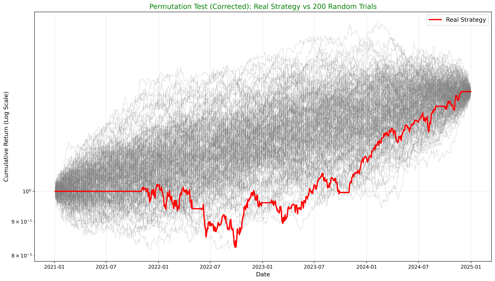
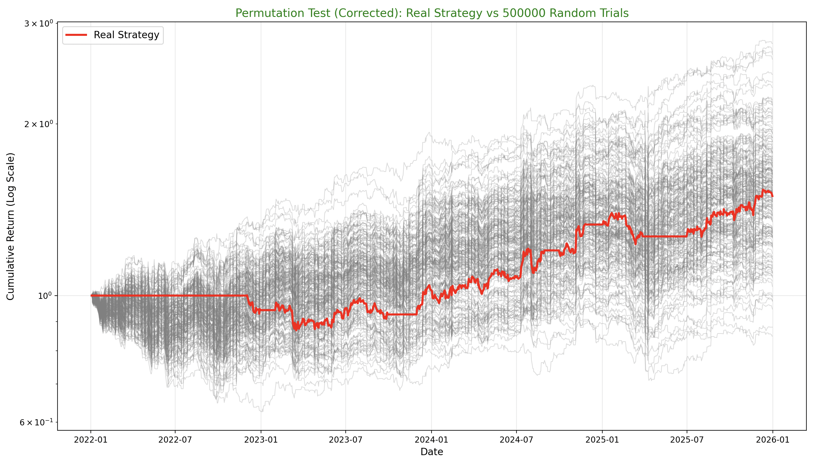

# qfin-lab


quant equity research framework i built for GAKA Labs. it screens a large stock universe down to a shortlist for the fundamental analysts, then backtests systematic strategies on it with realistic costs and a permutation test to check whether any outperformance is actually signal or just luck.

most of the work here has gone into making the backtest honest rather than making the numbers look good: point-in-time universe, no invented price history, liquidity-scaled costs, lagged weights, and significance test.

had to rebuild repo a while ago due to getting new ide, ruined commit history so had to reuild everything
---

## highlights

- **point-in-time s&p 500 universe** rebuilt from wikipedia revision history, so names that were acquired or dropped are still in the backtest while they were members. removes the survivorship bias you get from backtesting on today's constituents
- **no bfill, no fake history.** each name has an explicit listed window and is untradeable outside it, so a 2024 ipo can't pass a 200 day trend filter on data that never existed
- **realistic transaction costs.** liquidity-scaled bid-ask spread plus square root market impact, with a participation cap so the book never holds more than it could actually fill
- **c++ permutation test via pybind11.** 500k trials testing whether the *timing* of the signals has predictive power. precomputing a cross-pnl matrix in numpy cut the workload from ~500 billion operations to ~500 million (99.9% reduction)
- **tearsheets** as a single self-contained html file (equity curve, drawdowns, rolling sharpe, monthly heatmap, var/cvar, exposure, permutation distribution) so non-technical analysts at the weekly IC don't have to read csvs
- **scanner** that filters a ticker list through a trend filter then fundamental criteria, and outputs buy/watch signals plus a risk profile per stock

---

## backtesting engine

`tests/gaka_backtest_technicals.py` runs a long-only momentum strategy on the point-in-time s&p 500, 2022 to 2026.

**signal.** a stock is eligible when it's above its 200 day SMA, RSI(14) > 55, and ATR(14) / price < 5% (screens out names that are too volatile). on top of that there's a market regime filter: if SPY is below its own 200 day SMA the strategy holds nothing.

**portfolio.** rebalanced monthly, equal weighted across eligible names, capped at 5% per name. when fewer than 20 names qualify the rest sits in cash instead of piling into a handful of stocks. weights are lagged one day so decisions made on day t only trade on t+1, no lookahead.

**universe.** `qfin/universe.py` pulls the wikipedia s&p 500 constituents page as it stood at each quarter end and expands it into a daily membership mask. a name has to pass the signal, be priceable, *and* actually be in the index that day to be held. the snapshots are saved to `data/sp500_membership.csv` so results are reproducible without hitting the api again.

**costs.** this used to be a flat 2bp per unit of turnover, which is an institutional large cap number and was doing far too much. now it's:

- **spread**: a power law in dollar volume, calibrated to roughly 1-2bp for a mega cap trading $1bn a day, ~5bp at $100m, ~20bp at $10m, ~70bp at $1m. half the spread is paid on every one way trade
- **impact**: square root model, `cost ≈ 0.6 × daily vol × sqrt(participation)`, on an assumed $10m book
- **participation cap**: no position can need more than 10% of a day's dollar volume to build

there's also a corwin-schultz high/low spread estimator in `costs.py`, kept for illiquid names but not used by default since it's badly biased upward on large caps (prices apple at ~40bp vs a real ~1bp).

**reported:** annual return and vol, sharpe (excess of a 4% cash rate, not raw), sortino, calmar, max drawdown and duration, var/cvar 95, turnover, cost drag split into spread and impact, beta/alpha, tracking error, information ratio, up/down capture vs SPY.

---

## validation: the permutation test

the question it answers: *does the timing of the signals matter, or would the same allocations applied on random days do just as well?*

the first version shuffled the daily portfolio returns. that turned out to be useless, compounding is commutative so `(1+r1)(1+r2)...(1+rT)` is the same in any order, and every random trial ends on exactly the same final value as the real strategy:

<p align="center">
  
  <br><sub>the bug: every shuffled path lands on the real strategy's final value</sub>
</p>

the fix shuffles the *weight rows* instead, so each trial applies the real allocations to randomly chosen days. the p-value is the share of random trials that finish at or above the real strategy.

doing that naively in python is an O(trials × days × assets) loop, around 500 billion operations for 500k trials. so:

1. precompute a `(days × days)` cross-pnl matrix in numpy, `weights @ returns.T`, where entry `[i, j]` is the pnl of using day i's weights on day j's returns
2. pass the pointer into c++ (`tests/permutation.cpp`, exposed as `gaka_core` via pybind11), where each trial is just a shuffle and a lookup per day

that takes it down to ~500 million operations and keeps the hot loop out of the python interpreter.

<p align="center">
  
  <br><sub>real strategy (red) vs 500,000 random timing trials</sub>
</p>

---

## scanner

`tests/scanner/scanner.py` screens whatever tickers are in `scticker.csv` in two stages:

1. **bulk filter**: downloads a year of prices and drops anything below its 200 day SMA, which cuts the list down before the slow per-ticker calls
2. **screener**: pulls fundamentals for the survivors. a **buy** needs ROE > 15%, debt/equity < 100, P/E < 35 and a bullish trend, everything else is **watch**

risk mode outputs volatility, sharpe, max drawdown, VaR/CVaR 95, beta, sector beta and a simple sector shock exposure per name. results go to `scanner_results.csv` and `riskmetrics_results.csv`.

---

## running it

```bash
git clone https://github.com/redddhertance/qfin-lab.git
cd qfin-lab
pip install -r requirements.txt
pip install pybind11 beautifulsoup4 requests
```

build the c++ backend (output needs to sit in `tests/` so the backtest can import it):

```bash
c++ -O3 -shared -std=c++14 -fPIC $(python3 -m pybind11 --includes) \
    tests/permutation.cpp \
    -o tests/gaka_core$(python3 -c "import sysconfig; print(sysconfig.get_config_var('EXT_SUFFIX'))")
```

on mac add `-undefined dynamic_lookup`. (this was built on macos)

then:

```bash
python tests/gaka_backtest_technicals.py   # backtest + permutation test, writes reports/gaka_technicals_tearsheet.html
python tests/scanner/scanner.py            # prompts for [S] scanner / [R] risk metrics / [A] all
```

500k trials needs around 4gb of ram since the c++ side returns the full curve matrix. for a quick run use `GAKA_N_TRIALS=20000 python tests/gaka_backtest_technicals.py`.

price data is cached to `data/cache/` after the first run, delete it to force a fresh download.

---

## limitations / next up

- **low caps are parked for now.** the original version ran on the russell 2000 (IWM holdings), but without point-in-time membership that needed huge amounts of bfill to cover names listing and delisting mid sample, which was adding blank random history. moving to the s&p 500 with a pit universe fixed that. my current plan is to go back to small caps once i've found a reliable membership source
- **residual survivorship gap.** some historic s&p members can't be priced on yfinance (mostly acquisitions and renames), so they're still missing. the backtest prints how many,
- **fundamentals aren't backtested.** fundamental filters only live in the scanner since yfinance only gives current values, eg using today's ROE in a 2022 backtest is lookahead
- tearsheet may move from html to pdf for standardisation
